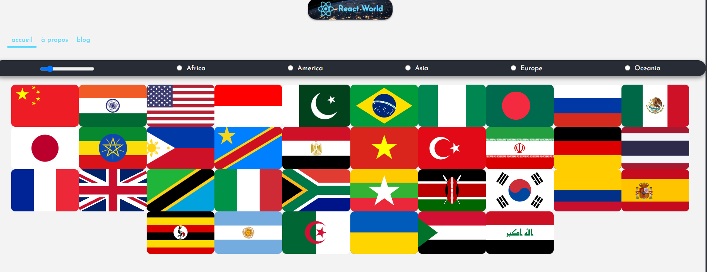
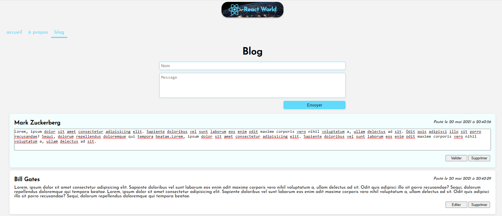

# React Course App : Countries infos cards & Blog page

## Description

## Launch the project

Install the dependencies with <code>npm install</code> command in the terminal.

Install JSON-SERVER : `npm install json-server`

Launch server `npm run server`

Then run the app in dev mode with <code>npm run start</code> command in the terminal which opens the default port [http://localhost:3000](http://localhost:3000).
